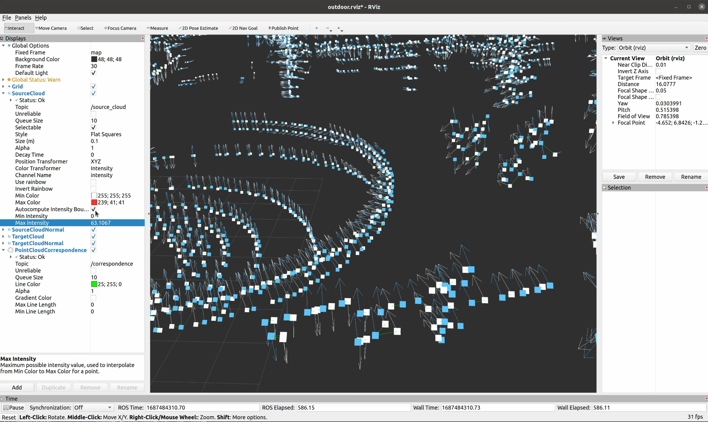

# icp_visualization
Visualize each iteration of ICP-like algorithms in RViz, including residuals, normals, correspondences.

## Dependencies
- Ubuntu 20
- ROS (Follow ROS official website to install)
- CMake, PCL, Eigen, yaml-cpp, OpenMP (we use their default versions in Ubuntu 20)
```
sudo apt install cmake libpcl-dev libeigen3-dev libyaml-cpp-dev libomp-dev
```
- Install our customized RViz plugins: clone the following packages into ROS workspace and install.
```
cd ~/catkin_ws/src
git clone https://github.com/UCR-Robotics/correspondence_rviz_plugin
git clone https://github.com/UCR-Robotics/pointcloud2_normal_rviz_plugin
cd ..
catkin_make install
```

## Installation

Place this package under a ROS workspace, and `catkin_make`.

## Usage

The parameters for ICP registration are set in the `config/params.yaml` file.
The path to source and target point clouds are set in the `launch/icp.launch` file.
Once parameters are set, there are two steps to launch this visualization tool:

1. Open RViz
```
roslaunch icp_visualization rviz.launch
```

2. Run ICP registration program
```
roslaunch icp_visualization icp.launch
```

## Demo



What does this mean?
- **Cyan (square-shape) points**: target cloud that remains fixed
- **White-to-red (square-shape) points**: source cloud being transformed in each iteration, with its intensity field visualized in white-to-red color to denote the residuals/errors associated with this point in the optimization (this can tell us what on-earth can each point contribute in the optimization)
- **Cyan arrows**: point normals of target cloud
- **White arrows**: point normals of source cloud
- **Green lines**: the correspondences in each iteration (the line connects two points: one in source and one in target)

Possible ways to interact with it:
1. It is possible to uncheck the `Autocompute Intensity Bounds` and set bounds for min/max manually. In this way, you can restrict the range of intensity values to be visualized in the white-to-red spectrum, providing a better visual effect.
  - For example, setting maximum value to be `0.01` can mark almost all points that are involved (have contributions to optimization) in solid red.
  - Setting maximum value to `5` can better visualize how points with intensity 0-5 are distributed; otherwise, only a few points that have very large intensity values are marked in red, making it hard to see the difference for all the rest of points.

2. It is possible to interact with the points by using the selection tool. Points that are selected will show up in the `Selection` window, where we can examine the exact intensity value (which reflects its contribution, i.e. the residuals/errors, to the optimization algorithm) of each point.
